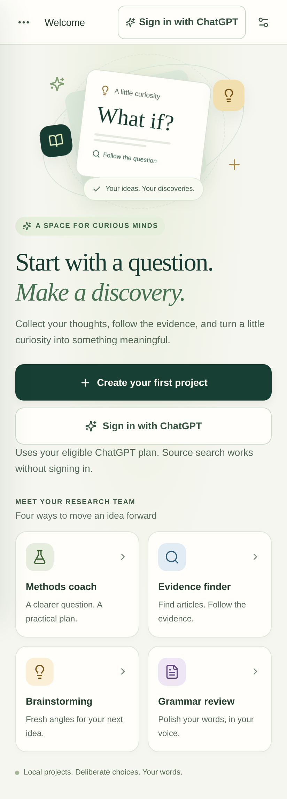
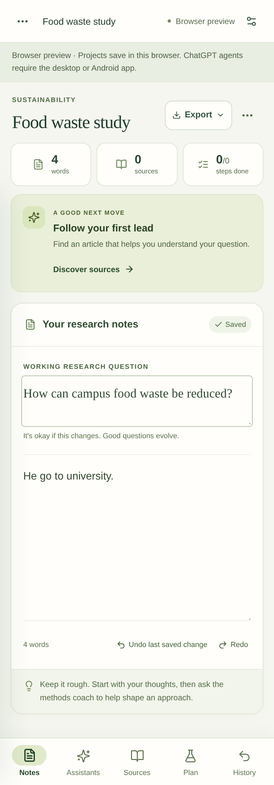
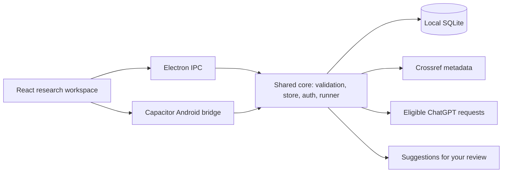

<p align="center">
  
</p>

# Research Bot

A personal research workspace for Android, Windows, Linux and macOS. Keep your questions, notes, sources and plans together, with four assistants whose suggestions you review before accepting.

[](https://github.com/Srimi1/research------bot/actions/workflows/check.yml)
[](LICENSE)
[](docs/android.md)
[](CONTRIBUTING.md)

**Android download:** [Research Bot 0.4.2 fresh production APK](downloads/android/research-bot-0.4.2-android.apk) · [Installation and checksums](downloads/android/README.md) · [Published 0.4.0 APK](https://github.com/Srimi1/research------bot/releases/download/v0.4.0/research-bot-0.4.0-android.apk)

**Mac download:** [Apple Silicon DMG](https://github.com/Srimi1/research------bot/releases/download/v0.4.1/research-bot-0.4.1-mac-arm64.dmg) · [Intel DMG](https://github.com/Srimi1/research------bot/releases/download/v0.4.1/research-bot-0.4.1-mac-x64.dmg) · [Mac installation and research guide](docs/macos.md)

**Beta:** local workflows and mocked authentication are tested. Live ChatGPT sign-in, account eligibility and AI output quality still need verification with a real account. See the [audit report](docs/audits/2026-10-06.md) for evidence and limits.

## A calmer research desk

<p align="center">
  
  
</p>

These are browser-rendered phone previews with synthetic data; the welcome screenshot uses a mocked Android account state. They are not photographs or real-device test results.

- **Your work, on your device:** local projects, autosaved notes, undo/redo, source annotations, editable plans and Markdown/JSON export.
- **Useful first steps:** an optional note outline, editable prompt shortcuts and a suggested next action based on your project's progress.
- **Phone-friendly controls:** bottom navigation, clearer dialogs, keyboard-aware layout and small animations that respect reduced motion.
- **Review before accepting:** grammar edits, ideas and proposed plans stay separate from your original notes until you choose to apply them.

| Assistant             | What it does                                                                                  | Research boundary                                                                  |
| --------------------- | --------------------------------------------------------------------------------------------- | ---------------------------------------------------------------------------------- |
| Methods coach         | Explains methods, refines a question and proposes a plan                                      | You decide the scope and accept the steps                                          |
| Evidence finder       | Searches Crossref scholarly metadata and organizes saved sources                              | Metadata is not full-text verification; findings are never invented                |
| Literature review     | Drafts a thematic review from selected saved abstracts and reading notes, with cited excerpts | Check each claim; this is a draft, not a systematic review or full-text assessment |
| Grammar editor        | Suggests corrections to spelling, punctuation and grammar                                     | Review meaning and voice before accepting an edit                                  |
| Brainstorming partner | Explores ideas, assumptions and alternative explanations                                      | Ideas remain suggestions, not established findings                                 |

Crossref discovery works without signing in. AI assistants require eligible ChatGPT plan access. The app does not request copied cookies or session tokens, and does not silently switch to separately billed API usage.

**0.4.2** adds literature review to Android and desktop. Select saved papers in **Assistants → Review**, inspect the supporting excerpts, then choose **Add reviewed draft to notes**. See the [literature review guide](docs/literature-review.md). Its signed Android production APK is a fresh installation named **Research Bot 0.4.2**, with its own package and storage alongside the existing app. The GitHub release is published. See the [fresh-install guide](docs/android-fresh-install.md).

## Install or build

**0.4.0 protects ChatGPT sign-in during browser consent on Android.** It adds a short foreground service during browser consent and an `RB-AUTH-INTERRUPTED` recovery notice if Android closes the app. **0.4.0 uses a new signing key and requires a fresh installation.** It cannot update 0.3.9 in place. Export every project and verify the saved files before removing the old installation; uninstalling deletes local projects, notes and settings. Automatic project import is not available. On Legion OS or another aggressive ROM, set **App info → Battery usage → Unrestricted** if sign-in is repeatedly interrupted. See [Android installation and signing](docs/android.md).

The signed **Android 0.4.2 fresh production APK is available in [downloads/android](downloads/android/README.md)** and attached to its draft release. Keep the existing app installed to retain its projects; the fresh app has separate data and cannot update the legacy package in place. [Release 0.4.0](https://github.com/Srimi1/research------bot/releases/tag/v0.4.0) retains the published legacy Android APK. Stable desktop installers are available in [release 0.4.1](https://github.com/Srimi1/research------bot/releases/tag/v0.4.1), with checksums. Mac beta builds are ad hoc signed without Developer ID signing/notarization and use manual updates; see the Mac guide for installation instructions.

| Platform   | Distribution / development                                                                                                      | Guide                                                               |
| ---------- | ------------------------------------------------------------------------------------------------------------------------------- | ------------------------------------------------------------------- |
| Android 8+ | [Signed 0.4.2 fresh production APK](downloads/android/research-bot-0.4.2-android.apk); published legacy 0.4.0 remains available | [Fresh production installation](docs/android-fresh-install.md)      |
| Windows    | NSIS installer                                                                                                                  | [Releases and updates](docs/implementation.md#releases-and-updates) |
| Linux      | AppImage; live sign-in needs a secure desktop keyring                                                                           | [Operating notes](docs/implementation.md#operating-notes)           |
| macOS 13+  | Apple Silicon and Intel DMGs; ad hoc signed beta, manual updates                                                                | [Mac installation and research](docs/macos.md)                      |

For Android 16 on the OnePlus 7T Pro, use the Android build. The app targets SDK 36 and supports Android 8 or later. No local AI model is bundled. Physical-device and custom-ROM behavior still need testing on your phone.

For development, install **Node.js 24**:

```sh
git clone https://github.com/Srimi1/research------bot.git
cd research------bot
npm ci
npm run dev       # Electron desktop
# or: npm run dev:web
```

The browser preview stores its own data in localStorage and supports notes, source searches and export. Install the desktop or Android app for ChatGPT sign-in; browser data does not automatically transfer to either app.

To build a debug APK, install **JDK 21** and **Android SDK 36**, set `JAVA_HOME` and `ANDROID_HOME`, then run:

```sh
npm run build:android
cd android
./gradlew --no-daemon assembleDebug lintDebug
```

Output: `android/app/build/outputs/apk/debug/app-debug.apk`. Debug and release APKs use different signing keys; see the [Android guide](docs/android.md) before switching between them.

## How it works



`core/` contains platform-independent behavior. `electron/` supplies desktop adapters; `src/android/` and the Java native plugin supply Android networking, private files and Keystore encryption. Both apps use the same validated request handlers. Project exports exclude credentials. Research content is stored locally without additional app-level encryption. Requests send the selected task text to the provider; the app discloses excerpts when notes are too long to share in full.

Read the [architecture](docs/architecture.md), [authentication decision](docs/authentication.md) and [implementation notes](docs/implementation.md) for the exact boundaries.

## Quality and contribution

```sh
npm run format:check
npm run lint
npm audit --audit-level=high
npm run test:toolchain
npm test
npm run test:electron-node
npm run build
npm run test:ui
```

CI also launches Electron, builds desktop packages on Linux/Windows/macOS and compiles/lints Android. See [CONTRIBUTING.md](CONTRIBUTING.md) for prerequisites and test commands.

- [Reusable top-to-bottom audit skill](.agents/skills/research-bot-audit/SKILL.md)
- [Audit findings, fixes and validation](docs/audits/2026-10-06.md)
- [Changelog](CHANGELOG.md) · [Brand assets](docs/branding.md)
- [Security reporting](SECURITY.md) · [Product specification](docs/product-spec.md)
- [Agent instructions](agents/README.md) · [Roadmap](docs/roadmap.md)

Maintained by [Srimi1](https://github.com/Srimi1). Licensed under [MIT](LICENSE).
