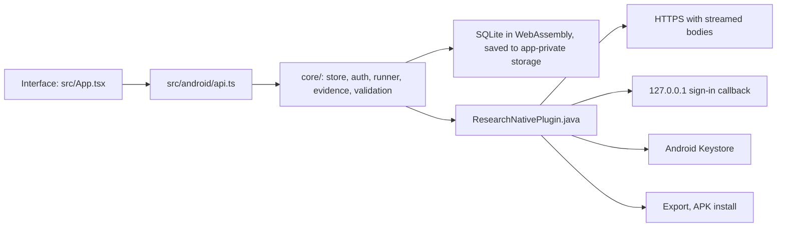

# Android app

The Android app is the same Research Bot as the desktop app: the same interface, the same four agents, the same SQLite project store, the same ChatGPT sign-in, the same Crossref search and export. It needs Android 8.0 or later and was built for Android 16 (target SDK 36).

## Install

1. On your phone, open the [latest release](https://github.com/Srimi1/research------bot/releases/latest) and download `research-bot-<version>-android.apk`.
2. Open the downloaded file. Android asks to allow installs from your browser or file manager the first time; allow it, then choose **Install**.
3. Open **Research Bot**. Your projects are stored only on this phone.

To check the download, compare its SHA-256 with `SHA256SUMS-android.txt` from the same release.

## Sign in with ChatGPT

In **Account & preferences**, choose **Continue with ChatGPT**. The sign-in page opens in your browser (a Custom Tab). After you approve, the browser returns to a page on `127.0.0.1` that the app is listening on, then you switch back to Research Bot. This is the same loopback sign-in the desktop app uses (RFC 8252). Stay on the sign-in page until it says ChatGPT is connected; it times out after five minutes.

Credentials are encrypted with a key held in the Android Keystore. The key cannot be exported, so app data is excluded from Android backups and device transfers. Use **Export** to keep a copy of your projects.

## Updates

With **Check for updates automatically** on, the app checks GitHub Releases about 15 seconds after it opens and every six hours. A newer APK downloads in the background and is only offered when all of these hold:

- its SHA-256 matches `SHA256SUMS-android.txt` in the same release,
- it is the Research Bot package and a higher version than the installed one,
- it is signed with the same certificate as the installed app.

The app then asks before opening Android's installer. The first time, Android asks you to allow Research Bot to install apps; allow it, then choose **Install** again.

## How it works



The backend in `core/` is shared with the desktop app, which supplies Node adapters from `electron/`. On Android it runs in the WebView with these adapters:

- **Network:** the WebView's own `fetch` cannot reach the ChatGPT endpoints (CORS), so requests go through the native plugin, which streams response bodies back chunk by chunk. Only HTTPS is allowed, and redirects are refused wherever the desktop refuses them.
- **Storage:** projects live in SQLite (sql.js), written atomically to app-private storage shortly after each change, before each request reports success, and whenever the app goes to the background.
- **Back gesture:** closes the open dialog or project drawer first, then leaves the app.

## Build it yourself

You need Node.js 24, JDK 21 and the Android SDK (platform 36). Then:

```sh
npm ci
npm run build:android                       # web bundle + Capacitor sync
cd android && ./gradlew assembleDebug       # android/app/build/outputs/apk/debug/app-debug.apk
```

`npm run icon:android` regenerates the launcher icons from `public/app-icon.png`.

## Release signing (one-time setup)

Every Android release must be signed with the same key, or installed copies cannot update. The release workflow reads the key from four repository secrets. Create them once:

1. Generate a key on your own computer (keep the file and passwords somewhere safe; losing them means users must uninstall and reinstall):

   ```sh
   keytool -genkeypair -v -keystore research-bot-release.jks -alias research-bot \
     -keyalg RSA -keysize 4096 -validity 10000
   ```

2. In GitHub, open **Settings → Secrets and variables → Actions** for this repository and add:
   - `ANDROID_KEYSTORE_BASE64`: the output of `base64 -w0 research-bot-release.jks` (on macOS: `base64 -i research-bot-release.jks`)
   - `ANDROID_KEYSTORE_PASSWORD`: the keystore password
   - `ANDROID_KEY_ALIAS`: `research-bot`
   - `ANDROID_KEY_PASSWORD`: the key password (the same as the keystore password if you pressed Enter at that prompt)

3. Release as usual (see [Releases and updates](implementation.md#releases-and-updates)). The **android** job builds, lints, verifies the signature, and attaches the APK and `SHA256SUMS-android.txt` to the release.

## Known limits

- Live ChatGPT sign-in and inference have the same open validation item as on desktop: they have been tested against mocked OpenAI responses, not yet with a real account.
- The app is distributed outside Google Play, so Play Protect may show a warning the first time.
- Only one copy of the app runs at a time on a phone, so credentials cannot be refreshed twice at once.
