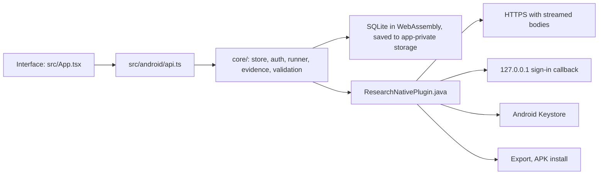

# Android app

The Android app is the same Research Bot as the desktop app: the same interface, the same four agents, the same SQLite project store, the same ChatGPT sign-in, the same Crossref search and export. It needs Android 8.0 or later and was built for Android 16 (target SDK 36).

## Install

1. Download the [signed Research Bot 0.3.5 APK](https://github.com/Srimi1/research------bot/raw/refs/heads/main/downloads/android/research-bot-0.3.5-android.apk). It is stored in the repository's [downloads/android folder](../downloads/android/README.md).
2. Open the downloaded file. Android asks to allow installs from your browser or file manager the first time; allow it, then choose **Install**.
3. Open **Research Bot**. Your projects are stored only on this phone.

To check this download, compare its SHA-256 with [downloads/android/SHA256SUMS.txt](../downloads/android/SHA256SUMS.txt). This APK uses the same personal certificate as the previously supplied 0.3.1, 0.3.2 and released 0.3.3 APKs, so it can update those installations. Install this version manually; automatic updates require an APK and checksums attached to a newer published GitHub release.

## Sign in with ChatGPT

In **Account & preferences**, choose **Continue with ChatGPT**. The sign-in page opens in your browser (a Custom Tab). After you approve, the browser returns to a page on `127.0.0.1` that the app is listening on, then you switch back to Research Bot. This is the same loopback sign-in the desktop app uses (RFC 8252). Stay on the sign-in page until it says ChatGPT is connected; it times out after five minutes.

Credentials are encrypted with a key held in the Android Keystore. The key cannot be exported, so app data is excluded from Android backups and device transfers. Use **Export** to keep a copy of your projects.

## Updates

With **Check for updates automatically** on, the app checks GitHub Releases about 15 seconds after it opens and every six hours. A newer APK downloads in the background and is only offered when all of these hold:

- its SHA-256 matches `SHA256SUMS-android.txt` in the same release,
- it is the Research Bot package and a higher version than the installed one,
- it is signed with the same certificate as the installed app.

The app then asks before opening Android's installer. The first time, Android asks you to allow Research Bot to install apps; allow it, then choose **Install** again.

## How it works



The backend in `core/` is shared with the desktop app, which supplies Node adapters from `electron/`. On Android it runs in the WebView with these adapters:

- **Network:** the WebView's own `fetch` cannot reach the ChatGPT endpoints (CORS), so requests go through the native plugin, which streams response bodies back chunk by chunk. Only HTTPS is allowed, and redirects are refused wherever the desktop refuses them.
- **Storage:** projects live in SQLite (sql.js). The file is written atomically to app-private storage one second after the last change and immediately when the app goes to the background. Writes are batched because each one saves the whole file; a failed write is kept and retried.
- **Back gesture:** closes the open dialog or project drawer first, then leaves the app.

## Build it yourself

You need Node.js 24, JDK 21 and the Android SDK (platform 36). Then:

```sh
npm ci
npm run build:android                       # web bundle + Capacitor sync
cd android && ./gradlew assembleDebug       # android/app/build/outputs/apk/debug/app-debug.apk
```

The debug APK is available at `android/app/build/outputs/apk/debug/app-debug.apk` and as `research-bot-android-debug` in successful CI runs. Debug, personal and official release signing certificates may differ. Android cannot install an APK over an existing app with a different certificate. Export projects before uninstalling; prefer an APK signed with the same key.

`npm run icon:android` regenerates the launcher icons from `public/app-icon.png`.

### Verify the packaged app

Start an Android emulator and run from the repository root:

```sh
python3 -m venv .venv-android-qa
.venv-android-qa/bin/pip install uiautomator2==3.7.0
RESEARCH_UIAUTOMATOR_PYTHON=.venv-android-qa/bin/python \
  node scripts/android-startup-smoke.mjs android/app/build/outputs/apk/debug/app-debug.apk
```

Use a fresh emulator without Research Bot data; the test creates synthetic projects. Set `ANDROID_SERIAL` when multiple devices are connected. The driver uses an active Android accessibility connection and UI-tree-derived taps. It creates a project through the form's keyboard navigation and verifies it after a cold reopen, adds notes, then cold-restarts again and verifies persistence. This avoids relying on stale within-page snapshots from the emulator's WebView 133. Evidence is written to `android-startup-results/`.

CI runs the same flow on Android 16. The release workflow additionally tests the exact signed APK before publication, while the **Android APK startup** workflow can test a published APK or the signed APK committed on the selected ref.

## Release signing (one-time setup)

Every Android release must be signed with the same key, or installed copies cannot update. The release workflow reads the key from four repository secrets. For an existing installation, use its original key. The personally signed APKs supplied to the maintainer use a separate private signing backup; do not generate a replacement key when preparing updates for those installations. Keys and passwords must stay out of Git. For a new distribution, create the secrets once:

1. Generate a key on your own computer (keep the file and passwords somewhere safe; losing them means users must uninstall and reinstall):

   ```sh
   keytool -genkeypair -v -keystore research-bot-release.jks -alias research-bot \
     -keyalg RSA -keysize 4096 -validity 10000
   ```

2. In GitHub, open **Settings → Secrets and variables → Actions** for this repository and add:
   - `ANDROID_KEYSTORE_BASE64`: the output of `base64 -w0 research-bot-release.jks` (on macOS: `base64 -i research-bot-release.jks`)
   - `ANDROID_KEYSTORE_PASSWORD`: the keystore password
   - `ANDROID_KEY_ALIAS`: `research-bot`
   - `ANDROID_KEY_PASSWORD`: the key password (the same as the keystore password if you pressed Enter at that prompt)

3. With **Android source: build**, the workflow validates that all four secrets exist before creating a manual draft. It publishes the draft only after the desktop and Android uploads succeed. Release as usual (see [Releases and updates](implementation.md#releases-and-updates)). The **android** job builds, lints, verifies the signature, and attaches the APK and `SHA256SUMS-android.txt` to the release.

### Release an existing signed APK

For a locally built and validated APK, run **Publish release** with **Android source: prebuilt**. Commit `downloads/android/research-bot-VERSION-android.apk`, `SHA256SUMS.txt` and `BUILD_INFO.json` first. The build information records the version, package, SDK levels, byte count, SHA-256, public certificate fingerprint and full build commit.

The workflow verifies the hash, certificate, package/version, SDK levels and 16 KiB alignment. It also requires the recorded build commit to be an ancestor of the release and all Android app/build inputs to be unchanged. If app inputs changed, rebuild and validate the APK before updating its build information. This path uses the existing signature without uploading the private key; it attaches `BUILD_INFO-android.json` as well as the APK and checksums. Desktop installers are still built normally, and the release stays draft until every upload succeeds.

## Android 16 and the OnePlus 7T Pro

The app targets SDK 36 and supports this Android version. It bundles the interface, native adapters and SQLite, not a local AI model. The maintainer's OnePlus 7T Pro with 12 GB RAM and 256 GB storage has ample capacity for the workspace. Legion OS-specific keyboard, browser callback, background saving and installer behavior still require physical-device validation; browser phone previews do not establish custom-ROM compatibility.

## Known limits

- Live ChatGPT sign-in and inference have the same open validation item as on desktop: they have been tested against mocked OpenAI responses, not yet with a real account.
- The app is distributed outside Google Play, so Play Protect may show a warning the first time.
- Only one copy of the app runs at a time on a phone, so credentials cannot be refreshed twice at once.

## If the app closes at launch

Install the current APK over your existing copy first; do not clear app data or uninstall it while diagnosing startup. Version 0.3.4 fixes SQLite's blocked WebAssembly initialization and corrects the splash-screen handoff. Its actual signed APK is tested on stock Android 16 before release; this does not establish behavior on every custom ROM.

Check that your ROM has an enabled, current Android System WebView provider. If the app still closes, connect the phone to a computer with Android Platform Tools and USB debugging enabled, then capture the Android crash buffer:

```sh
adb logcat -c
# Open Research Bot on the phone and let it close.
adb logcat -b crash -d > research-bot-crash.txt
```

Share the Research Bot exception and `Caused by` lines with the maintainer. Those identify the native failure; a build or browser preview cannot supply the physical phone's crash log. See the [startup investigation](audits/2026-10-07-android-startup.md).

## Sign-in says it is no longer active

Install version 0.3.5 or later over your existing app, then start a fresh sign-in from Research Bot. This version waits for the native callback response before closing the server, fixing a race that could replace a completed reply with “This sign-in is no longer active.” Do not reuse the old localhost callback URL; authorization codes are one-use. Stay in the browser until consent finishes, and switch back to Research Bot if Android does not return automatically. Cancelling, closing the account dialog or taking longer than five minutes still ends an attempt. Live account eligibility and inference remain unverified. See the [callback investigation](audits/2026-10-07-signin-and-macos.md).
