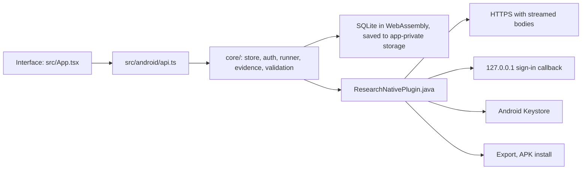

# Android app

The Android app is the same Research Bot as the desktop app: the same interface, the same four agents, the same SQLite project store, the same ChatGPT sign-in, the same Crossref search and export. It needs Android 8.0 or later and was built for Android 16 (target SDK 36).

## Install

**0.4.0 is in release preparation and uses a new signing key.** It cannot update an existing 0.3.x installation. Export every project and verify the saved files before removing the old app; uninstalling deletes its local projects, notes and settings. Exports are JSON/Markdown archives and automatic project import is not available. The current download below remains 0.3.9 until 0.4.0 is published.

1. Download the [signed Research Bot 0.3.9 APK](https://github.com/Srimi1/research------bot/releases/download/v0.3.9/research-bot-0.3.9-android.apk). It is stored in the repository's [downloads/android folder](../downloads/android/README.md).
2. Open the downloaded file. Android asks to allow installs from your browser or file manager the first time; allow it, then choose **Install**.
3. Open **Research Bot**. Your projects are stored only on this phone.

To check this download, compare its SHA-256 with [downloads/android/SHA256SUMS.txt](../downloads/android/SHA256SUMS.txt). This APK uses the same personal certificate as the previously supplied 0.3.1, 0.3.2 and released 0.3.3 APKs, so it can update those installations. Install this version manually; automatic updates require an APK and checksums attached to a newer published GitHub release.

## Sign in with ChatGPT

In **Account & preferences**, choose **Continue with ChatGPT**. The sign-in page opens in your browser (a Custom Tab). After you approve, the browser returns to a page on `127.0.0.1` that the app is listening on. When it says **Authorization received**, return to Research Bot to finish connecting. The code is exchanged only after the app is back in front. This is the same loopback sign-in the desktop app uses (RFC 8252).

In 0.4.0 a short foreground service keeps the callback process alive during consent. It shows a low-priority **Connecting ChatGPT…** notification and stops on every outcome. A notification permission prompt is not needed; denying notifications does not prevent the service. Android sign-in times out after 2 minutes 45 seconds, before the three-minute service limit. Desktop sign-in retains its five-minute deadline. Closing the account dialog or tapping **Cancel sign-in** cancels the attempt; returning from the browser keeps the dialog open.

If Android kills the process anyway, the next launch displays **RB-AUTH-INTERRUPTED**. Choose **Open battery settings**, then **Battery usage → Unrestricted** (wording varies by ROM), and begin a fresh sign-in. On Legion OS and other aggressive ROMs this can be necessary even with the foreground service. The recovery file contains a timestamp only while an attempt is active; it never stores an authorization code, callback URL or token.

Credentials are encrypted with a key held in the Android Keystore. The key cannot be exported, so app data is excluded from Android backups and device transfers. Use **Export** to keep a copy of your projects.

## Updates

With **Check for updates automatically** on, the app checks GitHub Releases about 15 seconds after it opens and every six hours. A newer APK downloads in the background and is only offered when all of these hold:

- its SHA-256 matches `SHA256SUMS-android.txt` in the same release,
- it is the Research Bot package and a higher version than the installed one,
- it is signed with the same certificate as the installed app.

The app then asks before opening Android's installer. The first time, Android asks you to allow Research Bot to install apps; allow it, then choose **Install** again.

## How it works



The backend in `core/` is shared with the desktop app, which supplies Node adapters from `electron/`. On Android it runs in the WebView with these adapters:

- **Network:** the WebView's own `fetch` cannot reach the ChatGPT endpoints (CORS), so requests go through the native plugin, which streams response bodies back chunk by chunk. Only HTTPS is allowed, and redirects are refused wherever the desktop refuses them.
- **Storage:** projects live in SQLite (sql.js). The file is written atomically to app-private storage one second after the last change and immediately when the app goes to the background. Writes are batched because each one saves the whole file; a failed write is kept and retried.
- **Back gesture:** closes the open dialog or project drawer first, then leaves the app.

## Build it yourself

You need Node.js 24, JDK 21 and the Android SDK (platform 36). Then:

```sh
npm ci
npm run build:android                       # web bundle + Capacitor sync
cd android && ./gradlew assembleDebug       # android/app/build/outputs/apk/debug/app-debug.apk
```

The debug APK is available at `android/app/build/outputs/apk/debug/app-debug.apk` and as `research-bot-android-debug` in successful CI runs. Debug and release APKs use different signing certificates. Use a fresh emulator for debug builds and the original signed release APK to update an existing installation.

`npm run icon:android` regenerates the launcher icons from `public/app-icon.png`.

### Verify the packaged app

Start an Android emulator and run from the repository root:

```sh
python3 -m venv .venv-android-qa
.venv-android-qa/bin/pip install uiautomator2==3.7.0
RESEARCH_UIAUTOMATOR_PYTHON=.venv-android-qa/bin/python \
  node scripts/android-startup-smoke.mjs android/app/build/outputs/apk/debug/app-debug.apk
```

Use a fresh emulator without Research Bot data; the test creates synthetic projects. Set `ANDROID_SERIAL` when multiple devices are connected. The driver uses an active Android accessibility connection and UI-tree-derived taps. It creates a project through the form's keyboard navigation and verifies it after a cold reopen, adds notes, then cold-restarts again and verifies persistence. This avoids relying on stale within-page snapshots from the emulator's WebView 133. Evidence is written to `android-startup-results/`.

CI runs the same flow on Android 16. The release workflow additionally tests the exact signed APK before publication, while the **Android APK startup** workflow can test a published APK or the signed APK committed on the selected ref.

## Release signing (one-time setup)

Releases 0.4.0 and later use the new certificate whose SHA-256 is committed in `android/release-signing-certificate.sha256` (`e07d0f1bb2e400e248c1b2af756d314686d912718127aed1e65d4344ad555a35`). Keep this private key for all later releases so 0.4.x installations can update in place. Releases 0.3.1–0.3.9 used the original certificate (`98580ca053712555a2b8a3a8fecfc15c85d83c5d192480e3b6b09ca13a633441`); Android cannot update those installations with the new key. The key itself and its passwords stay out of Git. For CI builds, configure four repository secrets under **Settings → Secrets and variables → Actions → Repository secrets**:

- `ANDROID_KEYSTORE_BASE64`: the keystore file as one line of base64 (`base64 -i <keystore> | tr -d '\n' | pbcopy` on macOS, `base64 -w0 <keystore>` on Linux)
- `ANDROID_KEYSTORE_PASSWORD`, `ANDROID_KEY_ALIAS`, `ANDROID_KEY_PASSWORD`

The release workflow tolerates whitespace-wrapped base64, checks the password and alias, and refuses to build unless the key's certificate matches the committed fingerprint. It verifies the built APK against that fingerprint again and records `BUILD_INFO-android.json` from the actual APK.

Keep a private backup of the 0.4.0 keystore and its passwords outside GitHub. If signing restoration fails, correct the four secrets using that backup. Do not generate another key or change the pinned fingerprint to make a release pass. A locally signed APK can also use the verified prebuilt release path below without exposing its private key to CI.

### Publish an Android release

Run **Publish release** from `main` with the version tag (for example `v0.4.0`), **Platforms: android**, and **Android source: build**. For 0.4.0 leave **Android upgrade from** empty because the signing certificate changed. For later releases, set it to a published version signed with the same key. Before publication the exact signed APK must pass fresh install, persistence and cold restart on Android 16; an optional same-key upgrade must also retain notes. Afterwards commit the published APK and `BUILD_INFO-android.json` as `downloads/android/research-bot-VERSION-android.apk` and `downloads/android/BUILD_INFO.json`, regenerate `downloads/android/SHA256SUMS.txt`, and update the download links. Emulator evidence and the maintainer's phone result are reported separately.

### Release an existing signed APK

For a locally built and validated APK, run **Publish release** with **Android source: prebuilt**. Commit `downloads/android/research-bot-VERSION-android.apk`, `SHA256SUMS.txt` and `BUILD_INFO.json` first. The build information records the version, package, SDK levels, byte count, SHA-256, public certificate fingerprint and full build commit.

The workflow verifies the hash, certificate, package/version, SDK levels and 16 KiB alignment. It also requires the recorded build commit to be an ancestor of the release and all Android app/build inputs to be unchanged. If app inputs changed, rebuild and validate the APK before updating its build information. This path uses the existing signature without uploading the private key; it attaches `BUILD_INFO-android.json` as well as the APK and checksums. Choose **Platforms: android** to publish only the APK, or **all** to include desktop installers. The draft is published only after every selected upload and the signed APK runtime check succeeds. Optionally set **Android upgrade from** to a previous published tag, such as `v0.3.7`, to test an in-place signed upgrade with project and note recovery.

## Android 16 and the OnePlus 7T Pro

The app targets SDK 36 and supports this Android version. It bundles the interface, native adapters and SQLite, not a local AI model. The maintainer's OnePlus 7T Pro with 12 GB RAM and 256 GB storage has ample capacity for the workspace. Legion OS-specific keyboard, browser callback, background saving and installer behavior still require physical-device validation; browser phone previews do not establish custom-ROM compatibility.

## Known limits

- Live ChatGPT sign-in and inference have the same open validation item as on desktop: they have been tested against mocked OpenAI responses, not yet with a real account.
- The app is distributed outside Google Play, so Play Protect may show a warning the first time.
- Only one copy of the app runs at a time on a phone, so credentials cannot be refreshed twice at once.

## If the app closes at launch

Install the current APK over your existing copy first; do not clear app data or uninstall it while diagnosing startup. Version 0.3.4 fixes SQLite's blocked WebAssembly initialization and corrects the splash-screen handoff. Its actual signed APK is tested on stock Android 16 before release; this does not establish behavior on every custom ROM.

Check that your ROM has an enabled, current Android System WebView provider. If the app still closes, connect the phone to a computer with Android Platform Tools and USB debugging enabled, then capture the Android crash buffer:

```sh
adb logcat -c
# Open Research Bot on the phone and let it close.
adb logcat -b crash -d > research-bot-crash.txt
```

Share the Research Bot exception and `Caused by` lines with the maintainer. Those identify the native failure; a build or browser preview cannot supply the physical phone's crash log. See the [startup investigation](audits/2026-10-07-android-startup.md).

## Sign-in says it is no longer active

Install version 0.3.6 or later over your existing app, then start a fresh sign-in from Research Bot. Versions 0.3.5 and later wait for the native callback response before closing the server, fixing a race that could replace a completed reply with “This sign-in is no longer active.” Do not reuse the old localhost callback URL; authorization codes are one-use. Stay in the browser until consent finishes, and switch back to Research Bot if Android does not return automatically. Cancelling, closing the account dialog or exceeding the sign-in deadline still ends an attempt. Live account eligibility and inference remain unverified. See the [callback investigation](audits/2026-10-07-signin-and-macos.md).

For the later message “ChatGPT sign-in did not complete,” use version 0.3.6 or later. It displays a safe reason and `RB-AUTH-…` code near the sign-in button and on the callback page, keeps the notice after restarting, and reuses an issued registration on retry. Share only that error text if sign-in still fails. Do not share the localhost address, authorization codes or tokens. A browser page alone from an older build does not distinguish a rejected exchange, network failure, invalid identity or credential-storage problem. See the [failure investigation](audits/2026-10-07-signin-diagnostics.md).

## Token request reports a network error

Version 0.3.7 fixes a reproduced compatibility bug: older WebView providers without `AbortSignal.any` could fail before sending any token request and display `RB-AUTH-EXCHANGE-NETWORK`. The new build supports that missing API, preserves safe Android DNS/TLS/timeout/connection reasons, and shows the app and WebView versions beside a sign-in failure. This does not establish the cause of a particular phone's failure. Keep Android System WebView current, install over the existing app and begin a fresh sign-in. Report only the error text and displayed versions if it fails. See the [transport investigation](audits/2026-10-07-android-auth-transport.md).

### DNS error during sign-in, but Check connection works

The reproduced cause was exchanging the authorization code while the browser was still in front. Android blocked the background app's networking, producing `RB-AUTH-EXCHANGE-DNS`. The 0.3.9 source fix waits for Research Bot to return to the foreground, but it has not been confirmed on the maintainer's phone. Version 0.4.0 keeps that fix and protects the callback with the foreground service. Follow the fresh-install instructions above for 0.4.0, then begin a fresh sign-in. See the [investigation](audits/2026-10-07-android-background-exchange.md).

### Connection check in Android 0.3.8

In **Account & preferences**, tap **Check connection** after a failed attempt. The optional check makes four bounded HTTPS requests: a direct native metadata request, metadata and signing-key requests through the app adapter, and a token POST containing a deliberately invalid fixture code/client. It does not use your account credentials. An HTTP 400 or 403 result on the dummy token request proves that request reached a responding server; it does not establish live sign-in or eligibility.

**Copy connection results** copies only fixed service labels, HTTP statuses/allowlisted failure codes, app/WebView versions and support flags. Share that report and the new `RB-AUTH-…` error to help distinguish a bridge failure from an HTTPS failure. Raw provider replies, callback URLs, account details and tokens are excluded.

Saved failures are labeled **Previous sign-in attempt** and hidden while a new attempt runs. Version information remains visible even if an optional native information query fails or times out. WebView compatibility fallbacks cover signal composition, timeouts and secure UUID creation. See the [follow-up audit](audits/2026-10-07-android-auth-follow-up.md).
