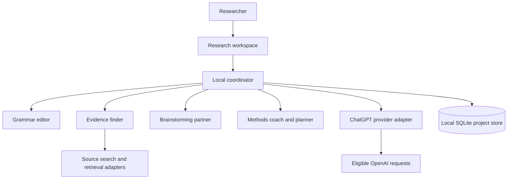

# Architecture

## Initial deployment

The beta uses a React/TypeScript interface in Electron, a Node/TypeScript main process, and SQLite for projects, notes, sources, plans, and run history. Renderer sandboxing and context isolation are enabled, renderer Node integration is disabled, and the preload exposes narrow, validated IPC methods. See [implementation notes](implementation.md) for validation and remaining limits.

The backend logic lives in `core/` and depends only on web standards plus small platform interfaces (`core/platform.ts`: fetch, private files, credential encryption, the loopback sign-in receiver, SQLite). The desktop supplies Node and Electron implementations in `electron/`; the [Android app](android.md) supplies WebView and native ones in `src/android/`. Request validation (`core/api.ts`) is shared, so both platforms accept and reject the same input.

## Coordination

Agents are specialized instructions with bounded inputs and outputs; they do not require separate accounts or model subscriptions. Route a selected task to the relevant agent instead of running every agent for every request. A combined planning request may call the coach and evidence finder, then present both outputs for human review. Use a concurrency limit, cancellation signal, retry cap, and per-run request budget.

Store draft suggestions separately from accepted researcher content. Every run records its role, selected inputs, status, model, timestamps, source references, and available usage metrics. Do not log credentials. Do not claim prompts alone guarantee grammar fidelity or source accuracy; add evaluation and human review.

## Provider boundaries

The main process handles authentication, credential refresh, inference, and tools. The renderer never receives bearer or refresh tokens. Keep provider-specific code behind `signIn`, `signOut`, `getAccount`, `listModels`, and `run` methods. Do not silently switch to separately billed API usage.

Implement multi-agent orchestration locally: the ChatGPT plan preview does not accept the Responses `multi_agent` field. Send context explicitly, use streaming, and disable server-side response storage. Hosted file-search tools are unavailable on this route; use local document extraction and retrieval. Recheck current limitations before implementing tool calls.

## Evidence handling

Search adapters return structured results with provenance. An initial scholarly adapter can be evaluated against Crossref or OpenAlex documentation, alongside permitted web search for reports and forums. Verify current access requirements before adopting an adapter. Distinguish metadata lookup, link resolution, full-text inspection, and claim verification.

Treat retrieved documents as untrusted content, never as instructions. Do not grant evidence tools shell access. Restrict network retrieval to HTTP(S), block loopback/private destinations, limit response size and time, and validate redirects. Open external sources in the system browser.

## Records

| Record         | Essential fields                                                                       |
| -------------- | -------------------------------------------------------------------------------------- |
| Project        | ID, title, topic, question, scope, created/updated timestamps                          |
| Note           | ID, project ID, original text, accepted text, version                                  |
| Suggestion     | ID, note/project ID, agent role, proposed edits/content, review state                  |
| Source         | ID, project ID, title, URL, DOI, authors, date, category, access level, retrieval date |
| Evidence entry | Source ID, claim or extract, locator, method, findings, limitations, researcher notes  |
| Plan step      | ID, project ID, order, purpose, output, dependencies, completion check, status         |
| Agent run      | ID, project ID, role, status, input references, output references, model, usage        |

Export project records without authentication data. Provide explicit delete/export controls. Store credentials separately in an OS-protected credential store and exclude them from project backups.
