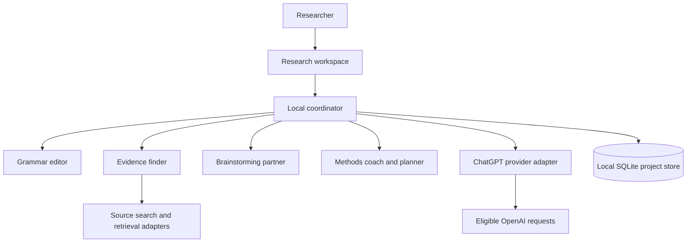

# Architecture

## Current implementation

The beta uses a React/TypeScript interface in Electron, a Node/TypeScript main process, and SQLite for projects, notes, sources, plans, and run history. Renderer sandboxing and context isolation are enabled, renderer Node integration is disabled, and the preload exposes narrow, validated IPC methods. See [implementation notes](implementation.md) for validation and remaining limits.

The backend logic lives in `core/` and depends only on web standards plus small platform interfaces (`core/platform.ts`: fetch, private files, credential encryption, the loopback sign-in receiver, SQLite). The desktop supplies Node and Electron implementations in `electron/`; the [Android app](android.md) supplies WebView and native ones in `src/android/`. Request validation (`core/api.ts`) is shared, so both platforms accept and reject the same input.

## Coordination

Agents are specialized instructions with bounded inputs and outputs; they do not require separate accounts or model subscriptions. The runner executes the selected role only. Evidence uses Crossref rather than an AI request; other roles use the selected eligible ChatGPT model. Up to two tasks run concurrently, with cancellation, a three-minute task deadline and a per-app-session AI request budget. A combined autonomous multi-agent workflow is not implemented.

Store draft suggestions separately from accepted researcher content. Every run records its role, selected inputs, status, model, timestamps, source references, and available usage metrics. Do not log credentials. Do not claim prompts alone guarantee grammar fidelity or source accuracy; add evaluation and human review.

## Provider boundaries

On desktop, the main process handles authentication, credential refresh and inference; bearer/refresh tokens are not exposed by the preload API. On Android, the same core runs inside the app's WebView. Native Keystore methods protect credentials at rest but return decrypted values into app memory for authorized requests. Android does not have the desktop process boundary. On both platforms, project exports exclude credentials and sign-in uses the system browser with PKCE, state, nonce and verified JWTs. There is no separately billed API-key fallback.

The provider receives explicit selected task input and streams a structured result with `store: false`. Grammar review refuses partial notes; methods and brainstorming disclose when an excerpt was shared. Hosted file search, local document extraction and arbitrary tool execution are not implemented. Recheck provider eligibility and current API restrictions before extending this boundary.

## Evidence handling

The implemented search adapter calls a fixed Crossref HTTPS endpoint with time and response-size limits. Results contain publisher-deposited metadata and DOI provenance. The researcher can add links to documents, reports and forums and record their own reading notes. The app does not crawl arbitrary pages, extract PDFs or automatically verify full-text claims.

Source and model content is untrusted and rendered as text. Evidence tools have no shell access. Source URLs are opened in the system browser after shared validation of protocol, credentials and literal local-address forms, including IPv6. This link check does not perform DNS resolution and is not an arbitrary-URL fetch service. OAuth/provider requests refuse redirects; native requests use HTTPS.

## Records

| Record         | Essential fields                                                                       |
| -------------- | -------------------------------------------------------------------------------------- |
| Project        | ID, title, topic, question, scope, created/updated timestamps                          |
| Notes/history  | Project notes, project version, bounded previous revisions and redo stack              |
| Suggestion     | Structured result stored in its run; applied changes stored in notes or accepted plan  |
| Source         | ID, project ID, title, URL, DOI, authors, date, category, access level, retrieval date |
| Evidence entry | Source ID, claim or extract, locator, method, findings, limitations, researcher notes  |
| Plan step      | ID, project ID, order, purpose, output, dependencies, completion check, status         |
| Agent run      | ID, project ID, role, status, input references, output references, model, usage        |

Export project records without authentication data. Provide explicit delete/export controls. Store credentials separately in an OS-protected credential store and exclude them from project backups.
